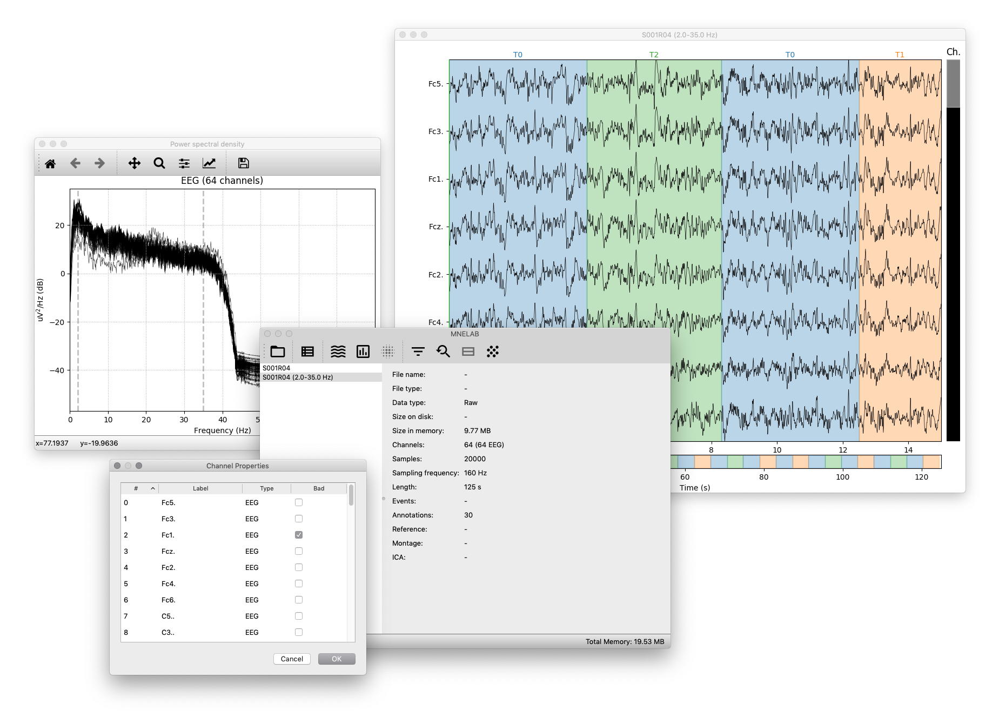

MNELAB
======

Graphical user interface (GUI) for [MNE](https://github.com/mne-tools/mne-python), a Python-based toolbox for EEG/MEG analysis.

### Screenshots

### Dependencies
MNELAB requires Python >= 3.6. In addition, the following Python packages are required:
- [PyQt5](https://www.riverbankcomputing.com/software/pyqt/download5) >= 5.6.0
- [NumPy](http://www.numpy.org/) >= 1.8.1
- [SciPy](https://www.scipy.org/scipylib/index.html) >= 0.17.1
- [Matplotlib](https://matplotlib.org/) >= 2.0.0
- [MNE](https://github.com/mne-tools/mne-python) >= 0.15

In general, it is recommended to always use the latest versions of these packages.

### Installation
A package on [PyPI](https://pypi.python.org/pypi) will be available soon. Meanwhile, to use MNELAB first install all dependencies (e.g. via `pip` or `conda`) and then [download the source code](https://github.com/cbrnr/mnelab/archive/master.zip). Unpack it into a folder of your choice and run `python3 mnelab.py` in this folder (if this does not work try `python mnelab.py`, just make sure to use Python 3).
