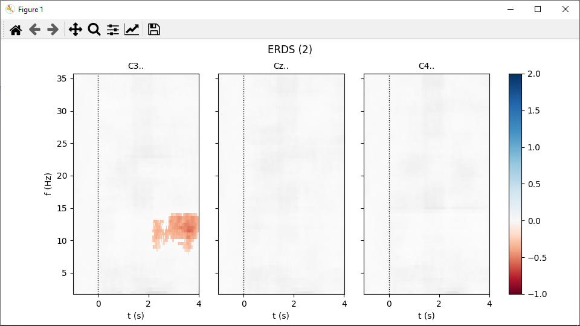

# Compute and visualize ERDS maps

This example is based on [this MNE-Python example](https://mne.tools/dev/auto_examples/time_frequency/time_frequency_erds.html), which also provides some background information on event-related (de)synchronization (ERDS).

## Download required files
Download data files for runs 6, 10, and 14 of subject 1 from the [EEG Motor Movement/Imagery Dataset](https://physionet.org/content/eegmmidb/1.0.0/):
- [S001R06.edf](https://physionet.org/files/eegmmidb/1.0.0/S001/S001R06.edf?download)
- [S001R10.edf](https://physionet.org/files/eegmmidb/1.0.0/S001/S001R10.edf?download)
- [S001R14.edf](https://physionet.org/files/eegmmidb/1.0.0/S001/S001R14.edf?download)

## Load data sets
In MNELAB, go to **_File&nbsp;–&nbsp;Open..._**, select the three downloaded files and click **_Open_**.
In the sidebar, the three data sets are now visible.
The data set loaded last ("S001R14") is highlighted, indicating it is currently "active".
The info panel on the right shows information about the active data set.

## Concatenate data
Now we want to concatenate the three data sets, starting with _S001R06_.
In the sidebar, select _S001R06_, then go to **_Edit&nbsp;–&nbsp;Append&nbsp;data..._**.
Select _S001R10_ and _S001R14_ in the **_Source_** panel – to select multiple items, hold <kbd>Ctrl</kbd> (<kbd>⌘</kbd> on macOS) while clicking.
Drag the selected data sets to the **_Destination_** panel (or click on the arrow button in the middle) and confirm with **_OK_**.
A new entry appears in the sidebar: "S001R06 (appended)".
Rename it "S001" by double-clicking the sidebar entry, entering the new name, and confirming with <kbd>Return</kbd>.
The entries **_Samples_** and **_Length_** in the info panel confirm that it is the result of the concatenation.
To close the original data sets, select each one in the sidebar and go to **_File&nbsp;–&nbsp;Close_**.

## Convert annotations to events
Splitting the raw data into epochs requires _events_.
The info panel shows that the data set already contains _annotations_, but no events.
To convert annotations to events, select **_Tools&nbsp;–&nbsp;Create&nbsp;events&nbsp;from&nbsp;annotations_**.
The **_Events_** entry in the info panel now reads "90 (1, 2, 3)", indicating there are a total of 90 events with IDs 1, 2, and 3:
- 1 (annotation T0): rest onset
- 2 (annotation T1): onset of hand motor imagery
- 3 (annotation T2): onset of feet motor imagery

## Split into epochs
Go to **_Tools&nbsp;–&nbsp;Create&nbsp;Epochs..._** (or select **_Create&nbsp;epochs_** in the toolbar).
In the dialog, select events "2" and "3" (the two task onsets).
You can click and drag to select multiple items in this dialog.
For **_Interval&nbsp;around&nbsp;events_** enter "-1.5" and "4.5" as start and end times, respectively.
We will create ERDS maps in the time interval from -1 to 4 seconds, but add half a second at the start and end to account for edge effects.
Uncheck **_Baseline&nbsp;Correction_** confirm with **_OK_** and select **_Create&nbsp;a&nbsp;new data set_**.
In the info panel, the **_Data&nbsp;type_** of the newly created data set ("S001 (epoched)") is now "Epochs".
If you select the original data set, you'll see that it is of type "Raw".
ERDS maps can only be calculated from "Epochs".

## Pick channels
Considering the motor imagery tasks, electrodes C3, Cz, and C4 should show the strongest activity.
Go to **_Edit&nbsp;–&nbsp;Pick&nbsp;channels..._** and select the desired channels.
Don't worry about the channel names containing trailing dots, that's how they are stored in the original data files.

## Plot ERDS maps
Select **_Plot&nbsp;–&nbsp;Plot&nbsp;ERDS&nbsp;maps..._** and enter the following values:
- Frequency range: "2" to "36"
- Step size: "0.5"
- Time range: "-1" to "4"
- Baseline: "-1" to "0"

Check **_Significance&nbsp;mask_**, leave **_alpha_** at "0.05" and confirm with **_OK_**.

Calculating the significance masks can take about a minute.
Eventually, two figures open up, one per event type:

