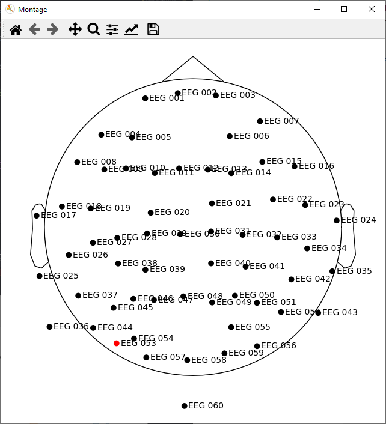
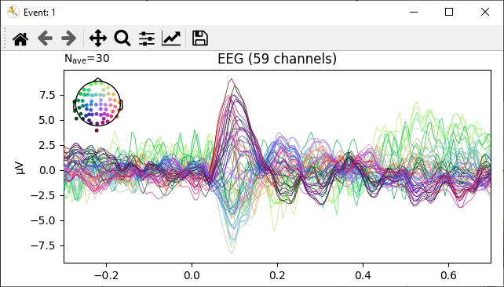
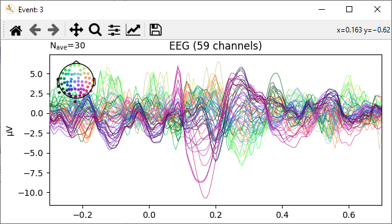
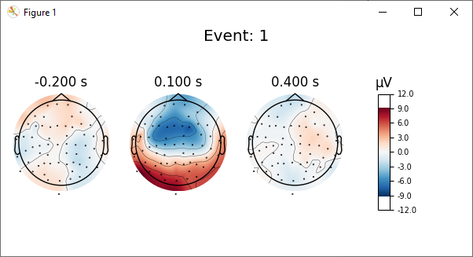
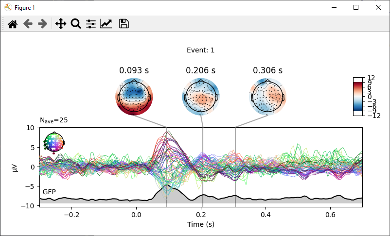
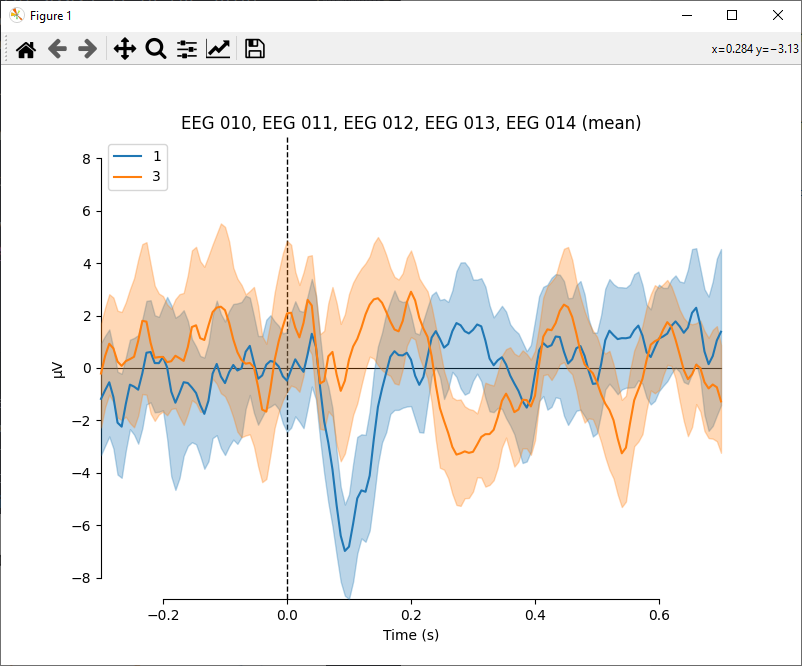

# Event Related Potentials (ERPs)
This example is based on [this MNE-Python tutorial](https://mne.tools/stable/auto_tutorials/evoked/30_eeg_erp.html).

## Download data

```{admonition} TODO
decide on data hosting, add download instructions
```
The [MNE-Python documentation](https://mne.tools/stable/overview/datasets_index.html#sample) provides details on the data set.


## Load data set and events
Go to **_File_** → **_Open..._** and select the *sample_audvis_filt-0-40_raw.fif* file you just downloaded.
In the info panel, you will see that no events or annotations are present.
To load the events file, go to **_File_** → **_Import events..._**, select *sample_audvis_filt-0-40_raw-eve.fif* and click **_Open_**.
The **_Events_** entry in the info panel now shows that a total of 319 events have been loaded.


## Crop data
This step is included in the MNE-Python tutorial to reduce the time it takes to generate the documentation.
Go to **_Edit_** → **_Crop data..._**, enter "90" in the **_Stop time_** field, and confirm with **_OK_**.
A duplicate of the data is created.
In the sidebar, you will recognize it by the suffix "(cropped)".


## Pick channels
Looking at the **_Channels_** entry in the info panel, you will see that this is a combined MEG and EEG data set.
We will only work with EEG data, so go to **_Edit_** → **_Pick channels..._**, choose **_By type_**, and select "eeg".
You are free to either create a new data set containing only the EEG channels or to overwrite the current one (we will not need it anymore).

## Plot channel locations
The FIF file already includes sensor locations, so we do not need to set a montage manually.
Go to **_Plot_** → **_Channel locations_** to see a 2D sensor location plot.
**_EEG 053_** is colored red because it is marked "bad".




## Filter data
To remove baseline drift, we will apply a simple highpass filter.
Go to **_Tools_** → **_Filter data..._** (or click the corresponding icon in the toolbar) and enter "0.1" as the low cutoff frequency.
Leave the high cutoff frequency empty and click **_OK_**.
Again, you are free to create a new data set or overwrite the existing one.


## Create epochs
We will work with events 1 and 3, which correspond to responses to left-ear auditory and left visual field stimuli, respectively.
Go to **_Tools_** → **_Create epochs..._** and select "1" and "3" in the **_Events_** list.
Enter "-0.3" and "0.7" as **_Interval around events_**, uncheck **_Baseline Correction_** and confirm with **_OK_**.


## Drop bad epochs
We can drop epochs by providing maximum peak-to-peak signal value thresholds.
Go to **_Tools_** → **_Drop bad epochs..._**, activate **_Reject_**, and enter "0.0001".


## Plot evoked potentials
Go to **_Plot_** → **_Evoked..._**, check **_Spatial colors_**, and click **_OK_**.
Two figures containing so-called "butterffly" plots will pop up, whose window titles show which event they belong to.

 

## Plot evoked topomaps
Now we will create topomaps of the potentials evoked by the auditory event (ID 1) at -200 ms, 100 ms, and 400 ms.
Go to **_Plot_** → **_Evoked topomaps..._** and select Event 1.
Under **_Select time point(s)_**, choose **_Manual_**, and enter "-0.2,0.1,0.4".
The resulting figure will look like this:



## Create joint plots
Butterfly plots and topomaps can be combined to a joint plot.
Go to **_Plot → Evoked_**, select event "1", and check **_GFP_** and **_Spatial colors_**.
Activate the **_Topomaps_** group and leave it set at **_Peaks_**.
The topomap time points are automatically chosen as the three largest peaks in the global field power (GFP).
You should see something like this:




## Compare conditions
So far, we have always plotted individual channels, with different events in separate figures.
To compare the auditory event to the visual one, go to **_Plot_** → **_Evoked comparison_**.
Judging by the first topomap (at 0.093 s) in the [joint plot above](#joint-plots), we expect a large negative peak in frontal-central positions (FC) for event 1.
The [channel location plot](#plot-channel-locations) tells us that the relevant channels are EEG 010–014.
So in the dialog, select channels EEG 010, EEG 011, EEG 012, EEG 013, and EEG 014.
Leave both event types selected, but change **_Combine channels_** to **_mean_**.
After confirming with **_OK_**, you will see the figure below.
Each line represents the average over the selected channels for a single event type, and shaded areas represent 95% confidence intervals.


