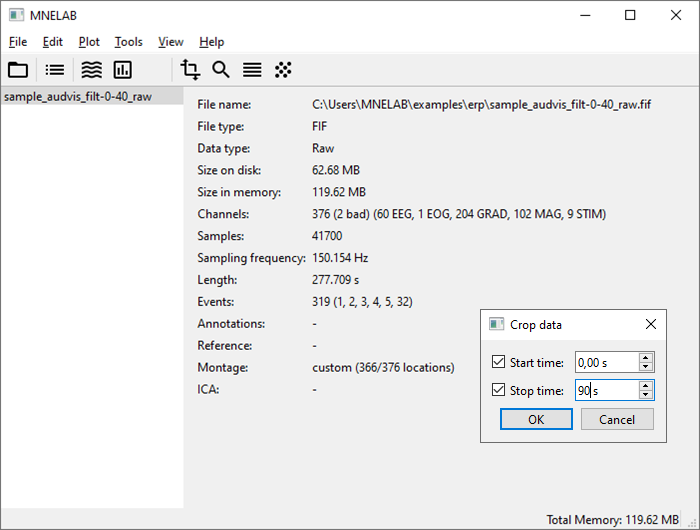
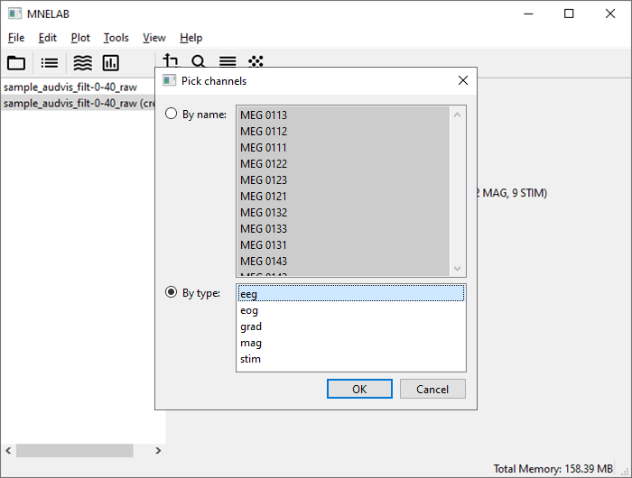
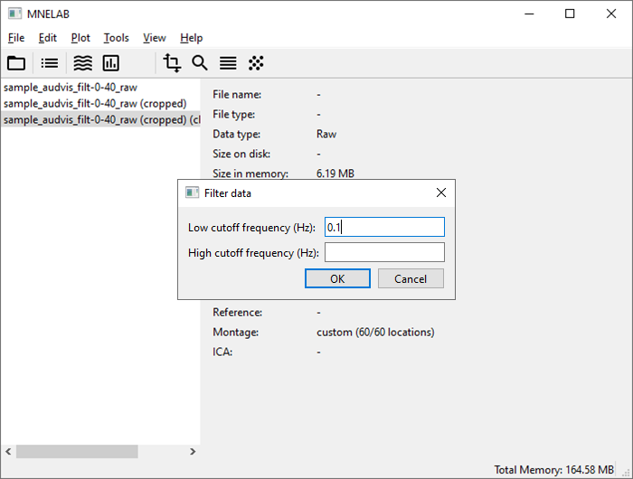
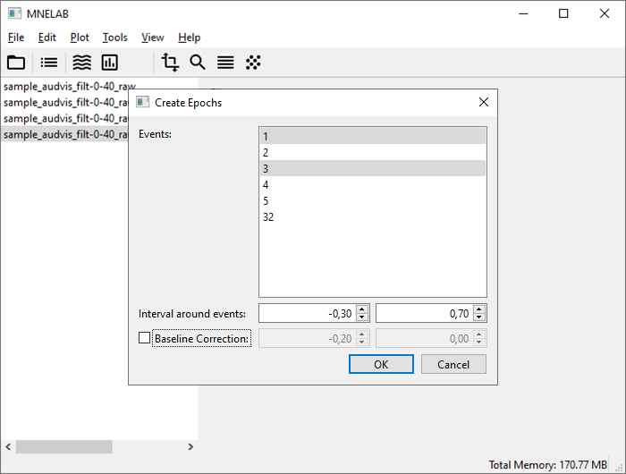
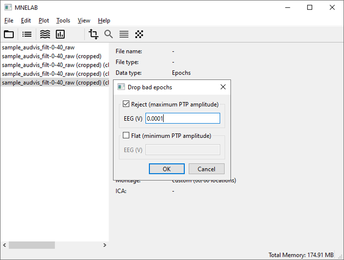
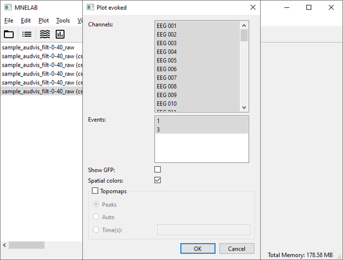
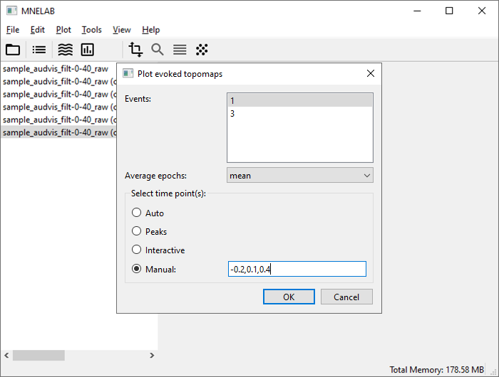
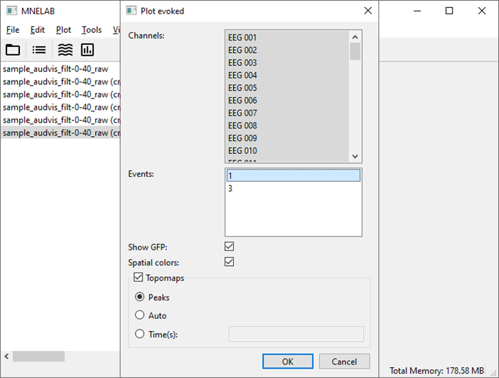

# Event-Related Potentials (ERPs)
This example is based on [this MNE-Python tutorial](https://mne.tools/stable/auto_tutorials/evoked/30_eeg_erp.html).

## Download data
Download the two files listed below, which are part of the [MNE-Python sample data](https://osf.io/86qa2/):

- Raw data: [sample_audvis_filt-0-40_raw.fif](https://osf.io/szh6d/download)
- Events: [sample_audvis_filt-0-40_raw-eve.fif](https://osf.io/xbvt2/download)

## Load data set and events
Select _File – Open..._ and pick the *sample_audvis_filt-0-40_raw.fif* file you just downloaded.
In the info panel, you will see that neither events nor annotations are present.
To load events from a separate file, go to _File – Import events..._, select *sample_audvis_filt-0-40_raw-eve.fif*, and click _Open_.
The _Events_ entry in the info panel now shows that a total of 319 events have been loaded.

## Crop data
This step is included in the MNE-Python tutorial to reduce the time it takes to generate the documentation.
Go to _Edit – Crop data..._, enter "90" in the _Stop time_ field, and confirm with _OK_.
A duplicate of the data is created.
In the sidebar, you will recognize it by the suffix "(cropped)".

## Pick channels
The _Channels_ entry in the info panel informs us that this is a combined MEG and EEG data set.
We will only work with EEG data, so go to _Edit – Pick channels..._, choose _By type_, and select "eeg".
You are free to either create a new data set containing only the EEG channels or to overwrite the current one (we will not need it anymore).

## Plot channel locations
The FIF file already includes sensor locations, so we do not need to set a montage manually.
Select _Plot – Plot channel locations_ to view a 2D sensor location plot.
_EEG 053_ is colored red because it is marked as "bad".

## Filter data
To remove baseline drift, we will apply a simple highpass filter.
Select _Tools – Filter data..._ (or click the corresponding icon in the toolbar) and enter "0.1" as the low cutoff frequency.
Leave the high cutoff frequency empty and click _OK_.
Again, you are free to create a new data set or overwrite the existing one.

## Create epochs
We will work with events 1 and 3, which correspond to responses to left-ear auditory and left visual field stimuli, respectively.
Select _Tools – Create epochs..._ and pick "1" and "3" in the _Events_ list.
Enter "-0.3" and "0.7" as _Interval around events_, uncheck _Baseline Correction_, and confirm with _OK_.

## Drop bad epochs
We can drop epochs by providing maximum peak-to-peak signal value thresholds.
Select _Tools – Drop bad epochs..._, activate _Reject_, and enter "0.0001" (corresponding to 100 µV).

## Plot evoked potentials
Select _Plot – Plot evoked..._, check _Spatial colors_, and click _OK_.

Two figures with so-called butterfly plots will pop up, and their window titles indicate which event they belong to.

 

## Plot evoked topomaps
Now we will create topographic maps (topomaps) of the potentials evoked by auditory event "1" at -200 ms, 100 ms, and 400 ms.
Go to _Plot – Plot evoked topomaps..._ and select event "1".
Under _Select time point(s)_, choose _Manual_, and enter "-0.2,0.1,0.4".

The resulting figure will look like this:

## Create joint plots
Butterfly plots and topomaps can be combined to a joint plot.
Select _Plot – Plot evoked..._, pick event "1", and check _GFP_ and _Spatial colors_.
Activate the _Topomaps_ group and leave it set at _Peaks_.

The topomap time points are automatically chosen as the three largest peaks in the global field power (GFP).
You should see something like this:

## Compare conditions
So far, we have always plotted individual channels, with different events in separate figures.
To directly compare the auditory to the visual event, select _Plot – Plot evoked comparison..._.
Judging by the first topomap (at 0.093 s) in the [previously created joint plot](#joint-plots), we expect a large negative peak in frontal-central locations (FC) for event "1".
The [channel location plot](#plot-channel-locations) tells us that the relevant channels are EEG 010–014.
In the dialog, select channels EEG 010, EEG 011, EEG 012, EEG 013, and EEG 014.
Leave both event types selected, but change _Combine channels_ to _mean_.

After confirming with _OK_, we get the figure below.
Each line represents the average over the selected channels for a single event type, and shaded ribbons represent 95% confidence intervals.

