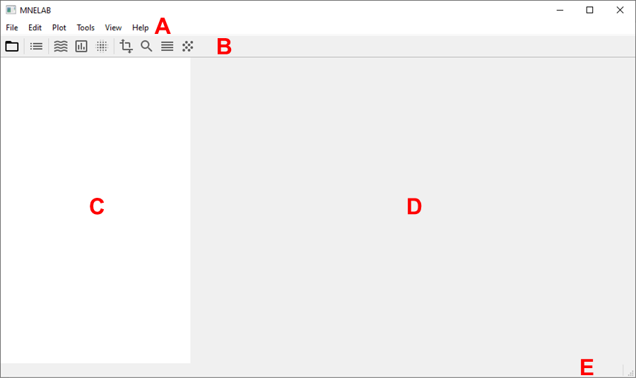
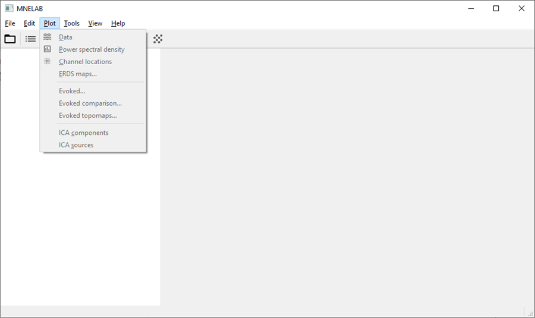
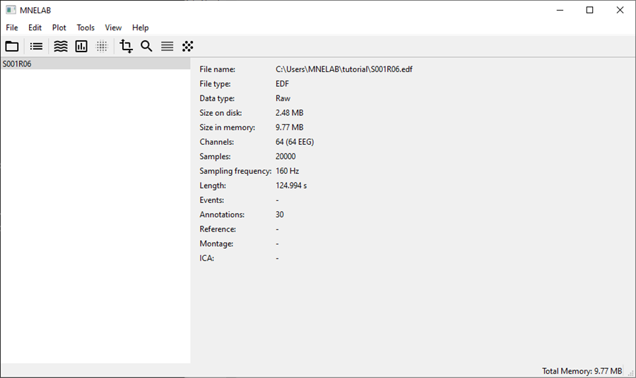
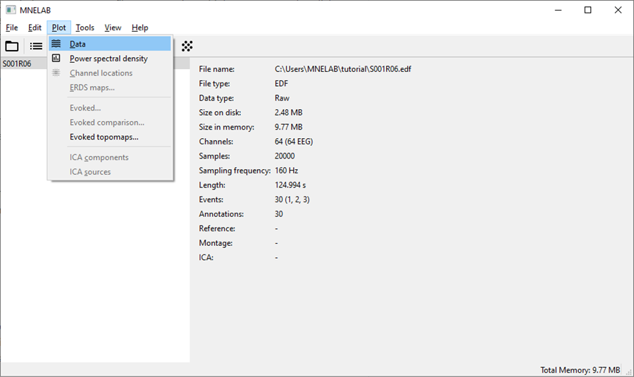

# Tutorial
## Installation
MNELAB requires [Python ≥ 3.8](https://www.python.org/downloads/) and can be installed with:

```
pip install mnelab
```

Optional dependencies provide additional features if installed:
- [scikit-learn](https://scikit-learn.org/stable/) ≥ 0.20.0 (ICA computation with FastICA)
- [python-picard](https://pierreablin.github.io/picard/) ≥ 0.4.0 (ICA computation with PICARD)
- [pyEDFlib](https://github.com/holgern/pyedflib) ≥ 0.1.15 (EDF/BDF export)
- [pybv](https://github.com/bids-standard/pybv) ≥ 0.4.0 (BrainVision VHDR/VMRK/EEG export)

If you want to use all MNELAB features, the full package including optional dependencies can be installed with:

```
pip install mnelab[full]
```

You can also install the latest development version as follows:

```
pip install git+https://github.com/cbrnr/mnelab
```


## First steps
Open a terminal and enter `mnelab` or `python -m mnelab` to start MNELAB.
The main window of MNELAB consists of a menu bar (A), a toolbar (B), a sidebar (C), an info area (D) and a status bar (E):



The main window looks pretty empty initially. In fact, almost all commands are disabled until you load a data set:



Click on the "Open" icon in the toolbar or go to "File" –> "Open..." and select a file in the dialog window.
The name of the loaded file appears in the sidebar and the info area shows information about the data set:



By clicking on "Plot" -> "Data", you can now visualize the raw data:


