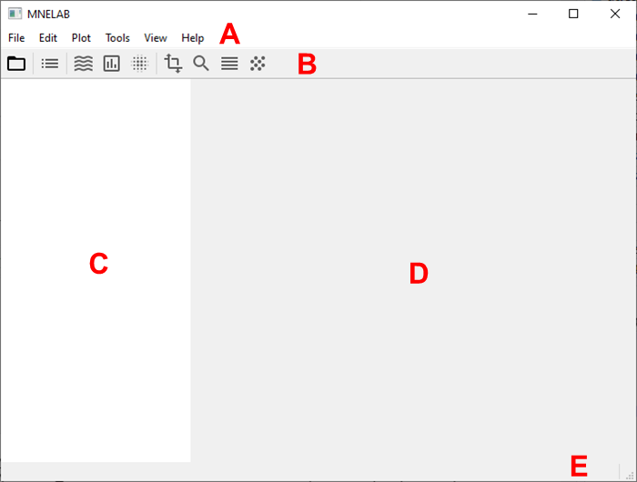
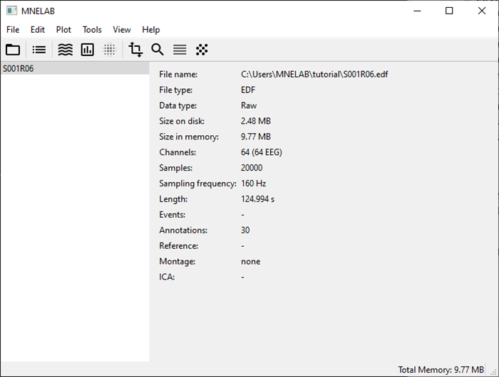
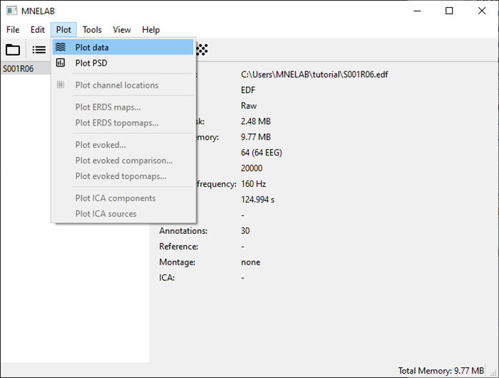

# Tutorial
## Dependencies
MNELAB requires Python ≥ 3.8 and the following packages:
- [mne](https://mne.tools/stable/index.html) ≥ 1.0.0
- [PySide6](https://www.qt.io/qt-for-python) ≥ 6.2.0
- [numpy](http://www.numpy.org/) ≥ 1.20.0
- [scipy](https://scipy.org/) ≥ 1.7.0
- [matplotlib](https://matplotlib.org/) ≥ 3.5.0
- [pyxdf](https://github.com/xdf-modules/xdf-Python) ≥ 1.16.0
- [pyobjc-framework-Cocoa](https://pyobjc.readthedocs.io/en/latest/) ≥ 7.3.0 (macOS only)

Optional dependencies provide additional features:
- [scikit-learn](https://scikit-learn.org/stable/) ≥ 1.0.0 (ICA computation with FastICA)
- [python-picard](https://pierreablin.github.io/picard/) ≥ 0.7.0 (ICA computation with PICARD)
- [pyEDFlib](https://pyedflib.readthedocs.io/en/latest/) ≥ 0.1.22 (EDF/BDF export)
- [pybv](https://pybv.readthedocs.io/en/stable/) ≥ 0.7.4 (BrainVision VHDR/VMRK/EEG export)

## Installation
You can install MNELAB with [pip](https://pip.pypa.io/en/stable/):

```
pip install mnelab
```

If you want to use all MNELAB features, the full package including optional dependencies can be installed with:

```
pip install mnelab[full]
```

You can also use [pipx](https://pypa.github.io/pipx/) to install MNELAB in a completely isolated environment:

```
pipx install mnelab
```

If you want the latest development version, use the following command:

```
pip install git+https://github.com/cbrnr/mnelab
```

Then start MNELAB in a terminal with `mnelab`.


## First steps
The main window of MNELAB consists of a menu bar (A), a toolbar (B), a sidebar (C), an info panel (D), and a status bar (E):



The main window looks pretty empty initially. In fact, almost all commands are disabled until you load a data set:


Click on the "Open" icon in the toolbar or select _File – Open..._ and pick a file in the dialog window.
The name of the loaded file appears in the sidebar, and the info panel shows information about the data set:



Select _Plot – Plot data_ to visualize the time course of the individual channels:


