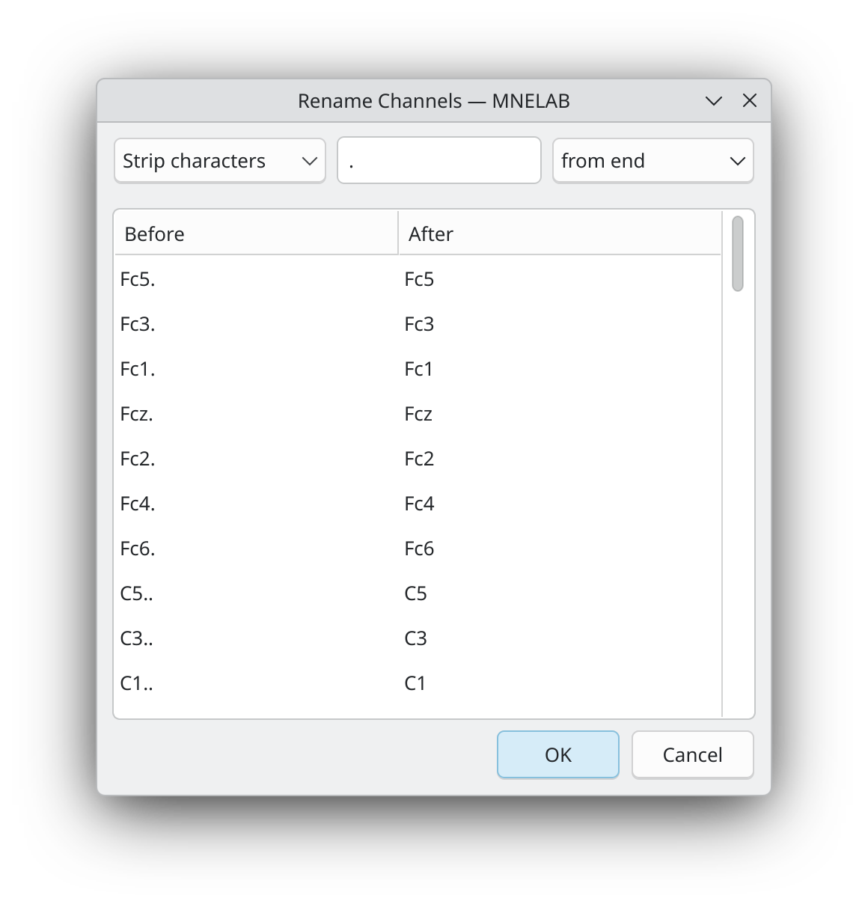
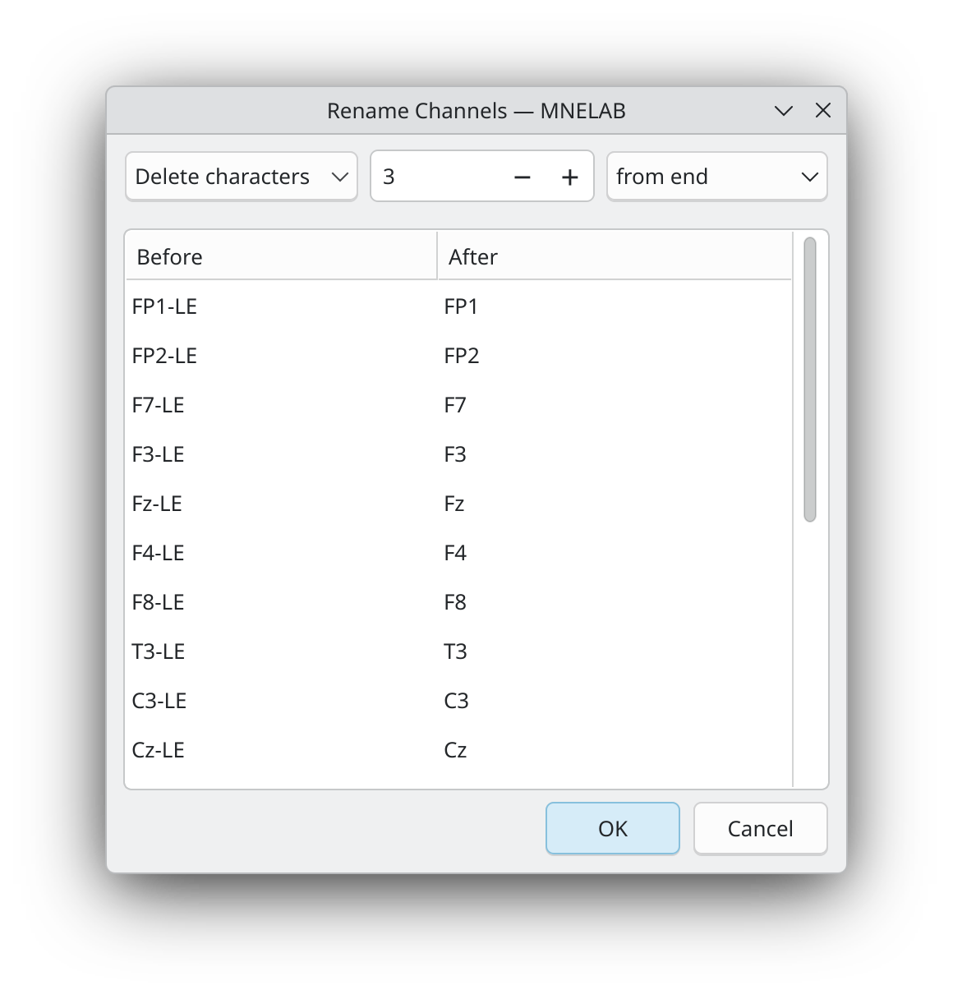
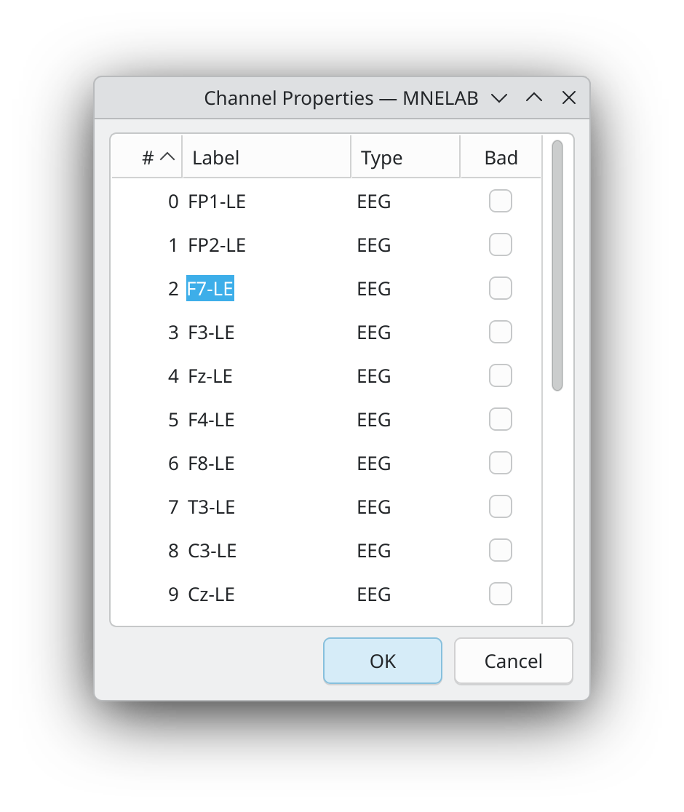

# Renaming Channels

We use [S001R06.edf](https://www.physionet.org/files/eegmmidb/1.0.0/S001/S001R06.edf?download) from the [EEG Motor Movement/Imagery Dataset](https://www.physionet.org/content/eegmmidb/1.0.0/) in this example. In this data set, all channel names contain trailing dots (for example, `C3..` instead of `C3`). These extra characters prevent MNELAB from correctly matching the channels to a standard montage (that is, predefined channel locations), so let's remove them from the channel names.

To do this, select *Channels – Rename Channels…* and configure the dialog as follows to strip the dots from the end of the channel names:

{ style="width: 50%" }

After clicking *OK*, the channel names are updated.

Whereas the *Strip characters* option removes a specified character (or characters) from the beginning or end of the channel names (including multiple occurrences), the *Delete characters* option removes a specified number of characters. We can use the [Australia-Pre-ICA.edf](https://osf.io/4g3uw/?action=download) example file to demonstrate how this works. In this file, all channel names end with "-LE". We could use the *Strip characters* option as before, but we can also use the *Delete characters* option to remove the last three characters from the channel names, which achieves the same result:

{ style="width: 50%" }

If you want to rename individual channels, select *Channels – Channel Properties…* and edit the channels names directly in the table by double-clicking on them:

{ style="width: 50%" }
