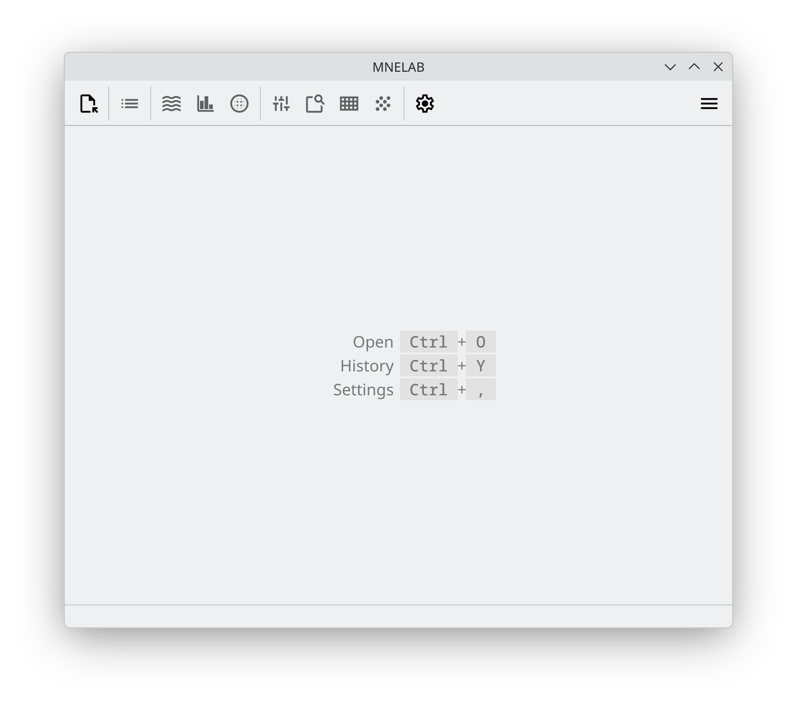
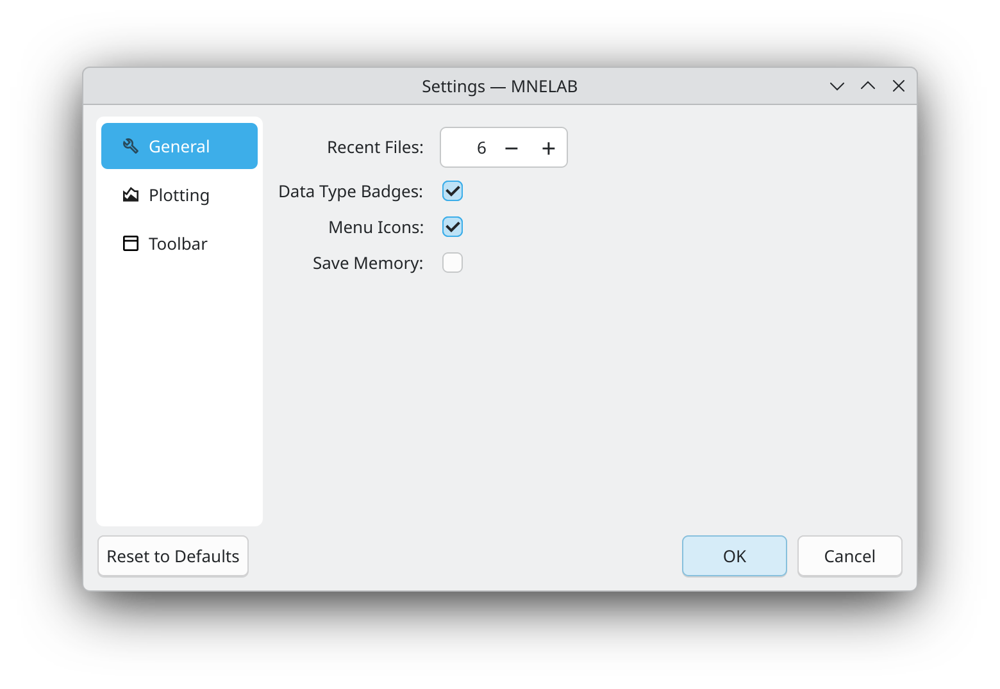
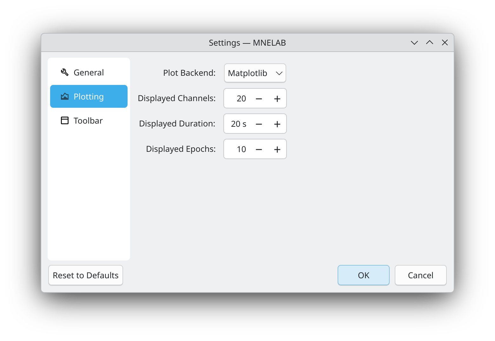
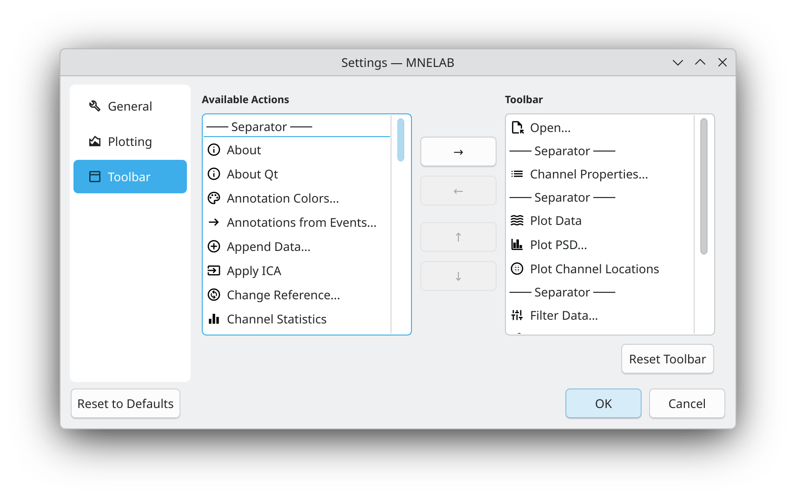

# Settings

MNELAB can be customized in various ways to suit your preferences and workflow. In this section, we will cover the basic settings available in MNELAB and how to configure them.

## View Menu

First, the *View* menu contains an option to toggle the status bar. On Linux and Windows, it is also possible to toggle the menu bar. If the menu bar is hidden, a hamburger menu will appear in the top right corner of the toolbar instead.

{ style="width: 50%" }

## Settings

The *Settings* menu contains three main sections: *General*, *Plotting*, and *Toolbar*. Note that you can always revert to the default settings by clicking the *Reset to Defaults* button. Let's now go through each of these sections in detail.

### General

The *General* section groups options related to the overall behavior of MNELAB.

{ style="width: 50%" }

The *Recent Files* option allows you to specify how many recently opened files should be displayed in the *File* menu for quick access.

The *Data Type Badges* option enables or disables the display of data type badges (e.g., "Raw", "Epochs") next to open datasets in the sidebar.

The *Menu Icons* option allows you to toggle icons in menus. Note that if you change this setting, you will need to restart MNELAB for the change to take effect.

Finally, the *Save Memory* option influences how MNELAB handles open datasets. If enabled, only the currently active dataset will be fully loaded into memory. This can be useful if you are working with many large datasets and want to reduce memory usage. However, keep in mind that switching between datasets may take slightly longer when this option is enabled.

### Plotting

The *Plotting* section contains options related to the appearance of plots in MNELAB.

{ style="width: 50%" }

The *Plot Backend* option allows you to choose between two different plotting backends for the data browser: *Matplotlib* and *Qt*. Whereas the *Matplotlib* backend provides a more traditional user experience, the *Qt* backend offers a more modern and possibly also more responsive interface.

The other options in this section allow you to customize the default appearance of the data browser, namely the number of display channels, the displayed signal duration on a single page, and if you are visualizing epochs, the number of epochs shown at once. Of course, these settings can be adjusted on a per-plot basis in the data browser itself, but they will be used as defaults when opening new plots.

### Toolbar

The *Toolbar* section allows you to customize the appearance of the toolbar in MNELAB.

{ style="width: 50%" }

The *Available Actions* list on the left contains all the actions that can be added to the toolbar, whereas the *Toolbar* list on the right shows the actions that are currently included in the toolbar. To add an action to the toolbar, simply select it in the *Available Actions* list and click the right arrow button. To remove an action from the toolbar, select it in the *Toolbar* list and click the left arrow button. You can also rearrange the order of actions in the toolbar by selecting an action in the *Toolbar* list and using the up and down arrow buttons to move it.

If you want to reset the toolbar to its default configuration, simply click the *Reset Toolbar* button.
