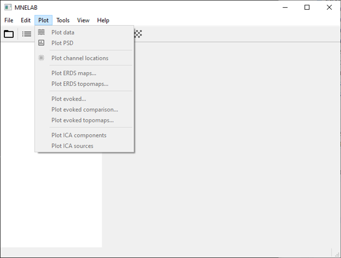
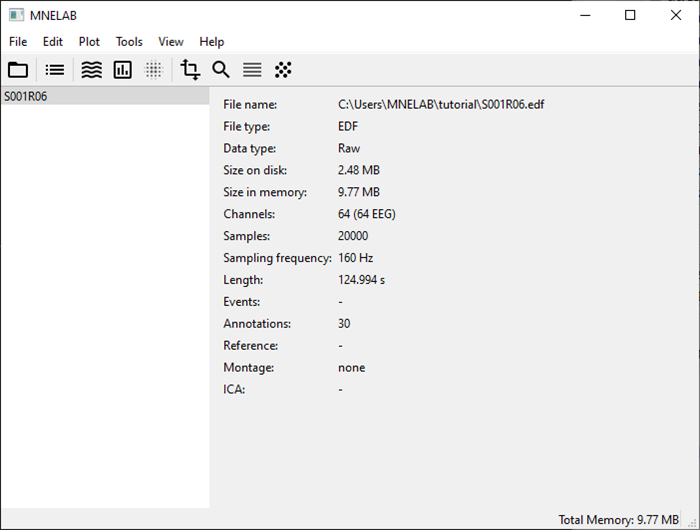

# Tutorial

## Installing MNELAB

We recommend our standalone installers currently available for macOS and Windows:

- [MNELAB 1.0.6 (macOS)](https://github.com/cbrnr/mnelab/releases/download/v1.0.6/MNELAB-1.0.6.dmg)
- [MNELAB 1.0.6 (Windows)](https://github.com/cbrnr/mnelab/releases/download/v1.0.6/MNELAB-1.0.6.exe)


## Running MNELAB

If you have installed MNELAB using the standalone installer, you can start it just like any other app from your applications menu or by double-clicking the application icon.

Alternatively, you can use [uv](https://docs.astral.sh/uv/) to run MNELAB:

```
uvx mnelab
```

If you want to run the latest development version, you can use the following command:

```
uvx --from https://github.com/cbrnr/mnelab/archive/refs/heads/main.zip mnelab
```


## First steps

The main window of MNELAB consists of a menu bar (A), a toolbar (B), a sidebar (C), an info panel (D), and a status bar (E):


The main window looks pretty empty initially. In fact, almost all commands are disabled until you load a data set:



Click on the "Open" icon in the toolbar or select _File – Open..._ and pick a file in the dialog window.
The name of the loaded file appears in the sidebar, and the info panel shows information about the data set:



Select _Plot – Plot data_ to visualize the time course of the individual channels:


