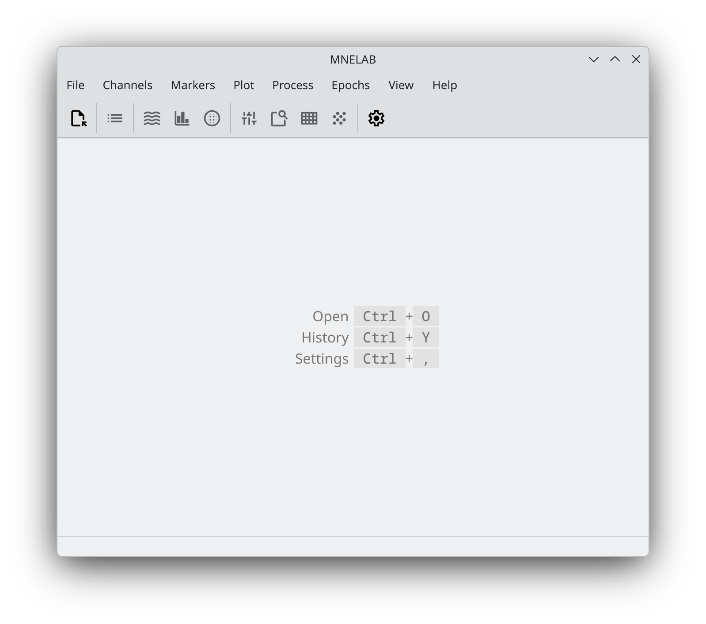
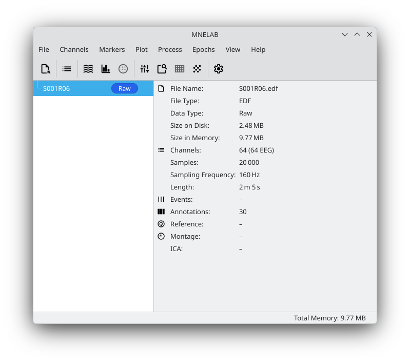

# Quick Start Guide

## Installing MNELAB

We recommend using the standalone installers for macOS and Windows:

- [MNELAB 1.5.1 (macOS)](https://github.com/cbrnr/mnelab/releases/download/v1.5.1/MNELAB-1.5.1.dmg)
- [MNELAB 1.5.1 (Windows)](https://github.com/cbrnr/mnelab/releases/download/v1.5.1/MNELAB-1.5.1.exe)

If you use [Arch Linux](https://archlinux.org/), you can install MNELAB from the [AUR](https://aur.archlinux.org/packages/python-mnelab) (e.g., `yay -S python-mnelab`).


## Running MNELAB

If you installed MNELAB using a standalone installer, launch it like any other desktop application – either from your applications menu or by double-clicking the application icon.

Alternatively, you can use [uv](https://docs.astral.sh/uv/) to run MNELAB directly without installing it (this works on all platforms, but for the best experience we recommend using the standalone installers when available):

```
uvx mnelab
```

To run the latest development version:

```
uvx --from https://github.com/cbrnr/mnelab/archive/refs/heads/main.zip mnelab
```


## First Steps

The main MNELAB window is mostly empty when you first open it:

{ style="width: 50%" }

Most commands remain disabled until you load a data set. To load a data set, click the *Open* button in the toolbar or select *File – Open…* from the menu bar. The data set appears in the sidebar, and the info panel displays information about it (we use [S001R06.edf](https://www.physionet.org/files/eegmmidb/1.0.0/S001/S001R06.edf?download) from the [EEG Motor Movement/Imagery Dataset](https://www.physionet.org/content/eegmmidb/1.0.0/) in this example if you want to follow along):

{ style="width: 50%" }

Now you can start exploring the data set, for example by visualizing the raw data with *Plot – Plot Data*, plotting the power spectral density with *Plot – Plot PSD*, or inspecting the annotations with *Markers – Edit Annotations…*.
